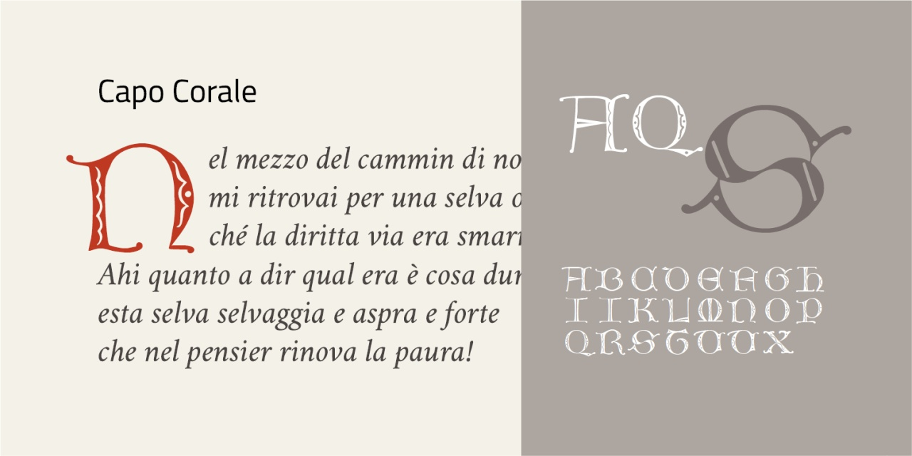
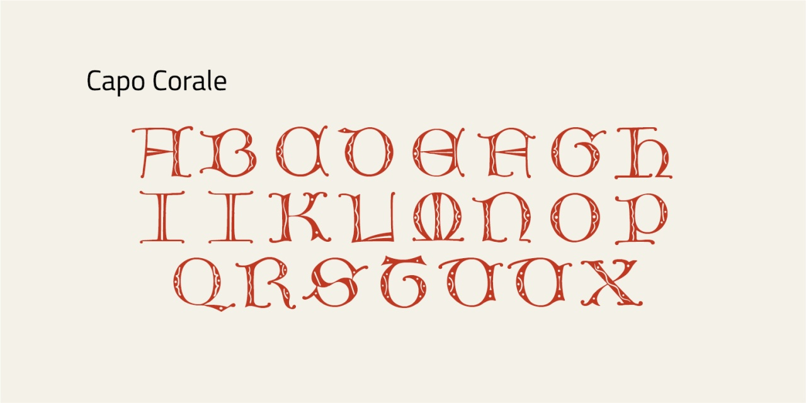
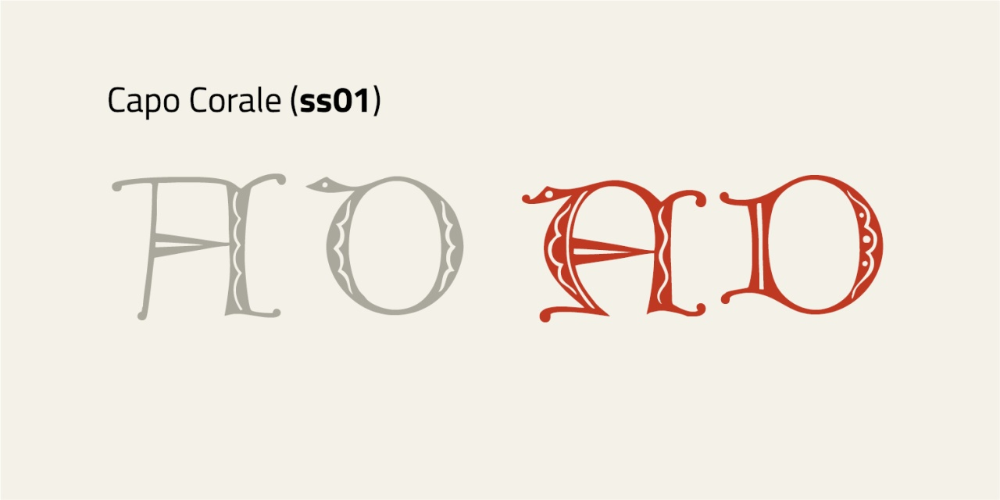
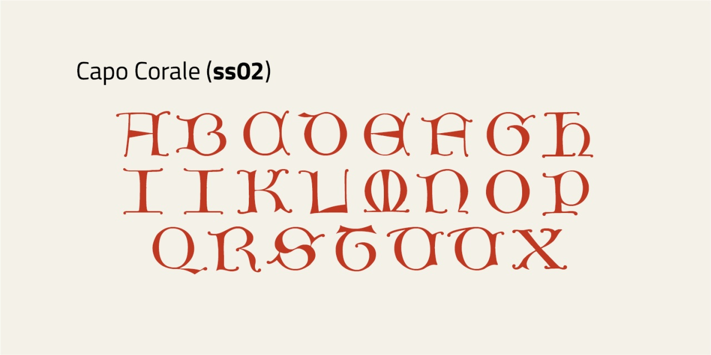

# Capo Corale
* Versione 1.101: fix esportazione
* Versione 1.0: versione iniziale

Per testare il font, vedere la [pagina interattiva](https://m-casanova.github.io/CapoCorale/).

## Descrizione

Il font _Capo Corale_ è basato su capolettera del carattere _Gotico Corale_ pubblicati nel [primo volume](https://archive.org/details/gri_33125015244383/page/n35/mode/2up) della _Paleografia artistica di Montecassino_ (1876). Trattandosi di un capolettera, sono presenti solo le lettere maiuscole (mancano le lettere W Y Z). Sono presenti forme alternative per A e D (tramite __ss01__).

È presente anche una variante priva di elementi decorativi (tramite __ss02__).

